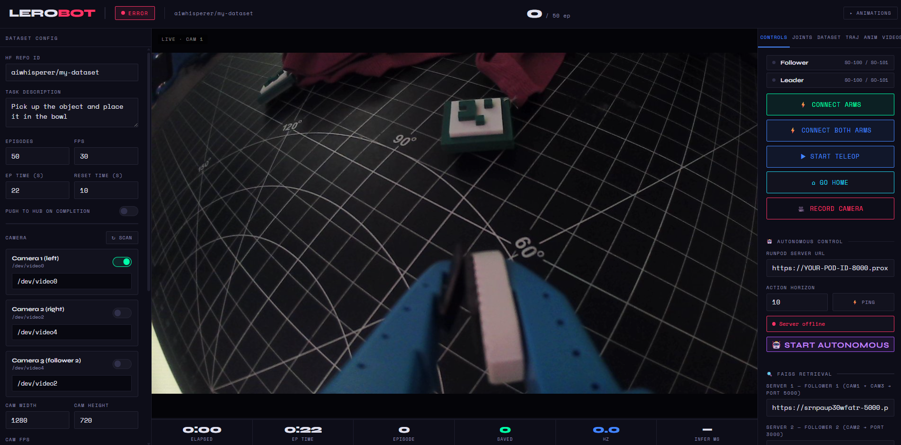

<div align="center">

<!-- Dashboard screenshot — replace with your own once deployed -->


<br/>

```
██╗      █████╗ ██╗   ██╗███╗   ██╗██████╗ ██████╗  ██████╗ ██████╗  ██████╗ ████████╗
██║     ██╔══██╗██║   ██║████╗  ██║██╔══██╗██╔══██╗██╔═══██╗██╔══██╗██╔═══██╗╚══██╔══╝
██║     ███████║██║   ██║██╔██╗ ██║██║  ██║██████╔╝██║   ██║██████╔╝██║   ██║   ██║   
██║     ██╔══██║██║   ██║██║╚██╗██║██║  ██║██╔══██╗██║   ██║██╔══██╗██║   ██║   ██║   
███████╗██║  ██║╚██████╔╝██║ ╚████║██████╔╝██║  ██║╚██████╔╝██████╔╝╚██████╔╝   ██║   
╚══════╝╚═╝  ╚═╝ ╚═════╝ ╚═╝  ╚═══╝╚═════╝ ╚═╝  ╚═╝ ╚═════╝ ╚═════╝  ╚═════╝    ╚═╝   
```

**A dual-arm robot teleoperation, animation, and data-collection studio built on [LeRobot](https://github.com/huggingface/lerobot).**

[](https://python.org)
[](https://github.com/huggingface/lerobot)
[](https://flask.palletsprojects.com)
[](LICENSE)
[](https://huggingface.co/datasets)

[**Quick Start**](#-quick-start) · [**Architecture**](#-architecture) · [**Data Collection**](#-collecting-data) · [**Animation Editor**](#-animation-editor) · [**FAISS Retrieval**](#-faiss-retrieval) · [**Contributing**](#-contributing)

</div>

---

## What is Laundrobot?

Laundrobot is a web-based control studio for **SO-101 / SO-100 robot arms**, designed for researchers and developers building robot learning datasets and autonomous systems. It wraps [HuggingFace LeRobot](https://github.com/huggingface/lerobot) with a high-density real-time dashboard that runs entirely on the robot's host machine and is accessible from any browser on the local network.

### Highlights

| Feature | Description |
|---|---|
| 🎮 **Teleoperation** | Leader/follower teleoperation with live joint visualization |
| 📷 **Multi-Camera** | Up to 3 simultaneous MJPEG streams (overview + wrist cams) |
| ⏺ **Data Collection** | Record LeRobot-format HuggingFace datasets with one click |
| 🎬 **Animation Editor** | Keyframe and motion-capture animation system for both arms |
| 📐 **Trajectory Recording** | Record and replay precise motor trajectories at full speed |
| 🔍 **FAISS Retrieval** | Vision-based episode retrieval for imitation playback |
| 🏠 **Home Position** | Saved default pose, triggerable from anywhere in the UI |
| 🤗 **HF Integration** | Push datasets directly to Hugging Face Hub |

---

## 📋 Requirements

### Hardware
- **Robot arms:** 1 or 2 × SO-101 (or SO-100) follower arms
- **Leader arms:** 1 or 2 × SO-100 leader arms (for teleoperation)
- **Cameras:** Up to 3 × USB webcams (V4L2-compatible)
- **Host:** Any Linux machine (Raspberry Pi 5, Jetson, x86 laptop)

### Software
- Python **3.10+**
- [LeRobot](https://github.com/huggingface/lerobot) (installed from source)
- A modern browser (Chrome / Firefox / Safari)

---

## 🚀 Quick Start

### 1 — Clone and install

```bash
git clone https://github.com/your-org/laundrobot.git
cd laundrobot

# Create a virtual environment (recommended)
python3 -m venv .venv
source .venv/bin/activate

# Install Laundrobot + dependencies
pip install -e ".[dev]"
```

### 2 — Install LeRobot

Follow the [official LeRobot installation guide](https://github.com/huggingface/lerobot#installation), then come back here.

```bash
# Quick version — install LeRobot from source alongside Laundrobot
git clone https://github.com/huggingface/lerobot.git ../lerobot
pip install -e ../lerobot
```

### 3 — Calibrate your arms

Laundrobot uses LeRobot's standard calibration files. If you haven't calibrated yet:

```bash
# Calibrate follower arm 1
python -m lerobot.scripts.control_robot calibrate \
  --robot-path lerobot/configs/robot/so101_follower.yaml \
  --robot-overrides '~cameras' \
  port=/dev/ttyACM0

# Calibrate leader arm
python -m lerobot.scripts.control_robot calibrate \
  --robot-path lerobot/configs/robot/so100_leader.yaml \
  port=/dev/ttyACM2
```

Calibration files are saved to:
```
~/.cache/huggingface/lerobot/calibration/robots/so_follower/<id>.json
```

### 4 — Launch the dashboard

```bash
# Single-arm setup (most common)
laundrobot --follower /dev/ttyACM0 --leader /dev/ttyACM2

# Dual-arm setup
laundrobot --follower /dev/ttyACM0 --follower2 /dev/ttyACM1 --leader /dev/ttyACM2

# With custom port
laundrobot --follower /dev/ttyACM0 --leader /dev/ttyACM2 --port 8080
```

Open **http://localhost:7860** (or replace `localhost` with your machine's IP to access from another device on the same network).

---

## ⚙️ Configuration

### Port assignments (default)

| Device | Port | Description |
|---|---|---|
| Follower 1 | `/dev/ttyACM0` | Primary robot arm (follower) |
| Follower 2 | `/dev/ttyACM1` | Second robot arm (dual-arm setups) |
| Leader | `/dev/ttyACM2` | Operator arm for teleoperation |

### Camera defaults

| Slot | Device | Role |
|---|---|---|
| Camera 1 | `/dev/video0` | Overview / Follower 1 primary |
| Camera 2 | `/dev/video4` | Wrist cam / Follower 1 secondary |
| Camera 3 | `/dev/video2` | Follower 2 dedicated |

All ports and camera devices can be changed live in the dashboard UI without restarting.

### Calibration IDs

The calibration ID maps to a JSON file in the LeRobot cache:

```
~/.cache/huggingface/lerobot/calibration/robots/so_follower/{id}.json
```

Default IDs:
- `follower` → arm 1 (port ACM0)
- `follower_3` → arm 2 (port ACM1)

Override on launch:
```bash
laundrobot --follower /dev/ttyACM0 --leader /dev/ttyACM2 \
  --follower-id my_arm_left
```

---

## 📡 Collecting Data

Laundrobot records datasets in the [LeRobot dataset format](https://github.com/huggingface/lerobot/blob/main/docs/datasets.md), compatible with all LeRobot training scripts.

### Step-by-step

**1. Connect your arms**

In the dashboard Controls panel, click **⚡ Connect Arms** (or **⚡ Connect Both Arms** for dual setups). The arm status dots should turn green.

**2. Configure your dataset**

In the left config panel:
- Set **HF Repo ID** — e.g. `your-username/laundrobot-folding`
- Write a clear **Task Description** — this becomes the `language_instruction` in your dataset
- Set **Episodes**, **FPS**, and **Episode Time**

**3. Start teleoperation**

Click **▶ Start Teleop** — the leader arm now controls the follower. Practice the task a few times before recording.

**4. Record**

Click **⏺ START RECORDING**. Perform the task naturally. When done:
- **→ Save Episode & Next** — saves the episode and resets for the next
- **← Discard** — throw away a bad take
- **■ Stop** — end the session

**5. Push to Hugging Face**

In the Dataset tab, select your dataset and click **⬆ Push to Hub**. Your dataset is now available for training.

### Tips for high-quality data

- Record at least **50 episodes** for a simple task; **200+** for complex manipulation
- Keep the camera position fixed across all episodes
- Use consistent lighting
- Reset the scene to the same starting configuration between episodes
- Record at **30 FPS** for smooth trajectories; lower FPS (10) if you need longer episodes within storage limits

### Dataset structure

```
~/.cache/huggingface/lerobot/your-username/your-dataset/
├── meta/
│   ├── info.json          # Dataset metadata
│   └── stats.json         # Per-feature statistics
├── data/
│   └── chunk-000/
│       ├── episode_000000.parquet
│       └── ...
└── videos/
    └── chunk-000/
        ├── observation.images.cam_left/
        └── observation.images.cam_right/
```

---

## 🎬 Animation Editor

The animation editor (`/animations`) lets you create repeatable arm motions — useful for homing sequences, post-FAISS resets, or dataset augmentation.

### Workflow

**Keyframe mode**
1. Use **● Live** to enable real-time joint control via sliders
2. Pose the arm using the sliders (or grab it physically with **🔓 Torque Off**)
3. Click **+ Keyframe** to capture the pose at the current timeline position
4. Repeat for each pose in your sequence
5. Hit **▶ Play** to preview

**Motion capture mode (recommended)**
1. Click **🔓 Torque Off** — the arm goes limp
2. Click **⏺ Rec** — sampling starts immediately
3. Move the arm by hand through the desired motion
4. Click **⏹ Stop**
5. Click **✓ Apply** — samples are automatically simplified into keyframes
6. Name and **💾 Save**

### Home position

Set the resting pose for your robot — it will be sent whenever you click **⌂ Go Home** anywhere in the dashboard:

1. Pose the arm using Live Control
2. Click **✎ Set as Home**

The home position is saved to `animations/home_position.json` and persists across restarts.

### Post-FAISS animation

After a FAISS trajectory completes, Laundrobot can automatically play an animation (e.g. to return the arm to a ready position). Set it in the right panel of the animation editor.

---

## 🔍 FAISS Retrieval

FAISS retrieval uses visual similarity to find the closest matching episode in your dataset and replay its actions on the robot — a form of non-parametric imitation learning.

### Setup

You need a running FAISS server (we use a RunPod deployment):

```bash
# On your RunPod instance
python -m laundrobot.faiss_server \
  --dataset your-username/laundrobot-folding \
  --port 5000
```

For dual-arm setups, run two servers (ports 5000 and 3000).

### Running FAISS retrieval

In the dashboard Controls panel:
1. Set the **Server 1** URL (e.g. `https://your-pod-id-5000.proxy.runpod.net`)
2. Optionally set **Server 2** for dual-arm
3. Choose **Both Arms / Fol 1 Only / Fol 2 Only** mode
4. Click **🔍 START FAISS RETRIEVAL** — a 3-second countdown gives you time to abort
5. The robot will execute the closest matching episode trajectory

---

## 🏗 Architecture

```
laundrobot/
├── lerobot_dashboard/
│   ├── main.py              # CLI entry point
│   ├── app.py               # Flask app factory
│   ├── config.py            # RecordSession dataclass (all runtime config)
│   ├── state.py             # Shared mutable state + threading events
│   ├── robot.py             # Robot construction helpers
│   ├── camera.py            # Camera frame management
│   ├── trajectory.py        # Trajectory save/load/list
│   ├── frame_store.py       # Per-frame observation cache
│   ├── logging_utils.py     # Dashboard log ring buffer
│   │
│   ├── loops/               # Background threads (one concern each)
│   │   ├── preview.py       # Camera preview loop (owns serial bus at idle)
│   │   ├── teleop.py        # Leader→Follower teleoperation loop
│   │   ├── recorder.py      # Dataset episode recording loop
│   │   ├── autonomous.py    # Autonomous inference loop
│   │   ├── faiss.py         # FAISS retrieval + trajectory execution loop
│   │   ├── animation.py     # Keyframe animation playback + recording
│   │   └── traj.py          # Raw trajectory record + playback loops
│   │
│   ├── routes/              # Flask blueprints (one file per domain)
│   │   ├── index.py         # GET /
│   │   ├── arms.py          # /api/arms/*
│   │   ├── record.py        # /api/record/* /api/teleop/* /api/home
│   │   ├── camera_routes.py # /stream /stream2 /stream3
│   │   ├── faiss_routes.py  # /api/faiss/*
│   │   ├── animation_routes.py # /api/animation/* + GET /animations
│   │   ├── traj_routes.py   # /api/traj/*
│   │   ├── autonomous_routes.py
│   │   ├── video_routes.py
│   │   └── dataset.py
│   │
│   └── templates/
│       ├── index.html       # Main recording dashboard
│       └── animation.html   # Animation editor
│
├── docs/
│   ├── assets/              # Screenshots, diagrams
│   ├── api.md               # Full API reference
│   ├── hardware.md          # Wiring and assembly guide
│   └── training.md          # Training models on collected data
│
├── scripts/
│   ├── check_cameras.sh     # Detect and list all /dev/video* devices
│   ├── check_ports.sh       # Detect and list all /dev/ttyACM* devices
│   └── setup_udev.sh        # Install persistent udev port aliases
│
├── pyproject.toml
├── requirements.txt
└── README.md
```

### Key design decisions

**Serial bus ownership** — only one loop at a time touches the serial port. The `preview` loop owns the bus at idle. Any other loop (`faiss`, `traj`, `animation`) calls `loops.preview.stop()` before starting and `loops.preview.start()` in its `finally` block. This eliminates `[TxRxResult] Port is in use!` errors.

**Wall-clock trajectory timing** — trajectory playback derives the frame index from real elapsed time (`idx = int(elapsed * fps)`), not from accumulated `target_dt`. If one frame runs long, the next frame self-corrects instead of drifting forever.

**No `get_observation()` during playback** — during trajectory replay the robot knows exactly where it's sending the arm. Reading current positions during playback costs 10–15ms per frame (doubling latency at 30fps) for no benefit.

---

## 🔌 API Reference

The full REST API is documented in [`docs/api.md`](docs/api.md). Key endpoints:

| Method | Endpoint | Description |
|---|---|---|
| `GET` | `/` | Dashboard HTML |
| `GET` | `/animations` | Animation editor HTML |
| `GET` | `/api/status` | Full system status JSON |
| `POST` | `/api/arms/connect` | Connect follower + leader |
| `POST` | `/api/teleop/start` | Start teleoperation |
| `POST` | `/api/record/start` | Start dataset recording |
| `POST` | `/api/record/save_episode` | Save current episode |
| `POST` | `/api/faiss/start` | Start FAISS retrieval |
| `POST` | `/api/home` | Send arms to home position |
| `GET` | `/api/animation/list` | List saved animations |
| `POST` | `/api/animation/play` | Play an animation |
| `POST` | `/api/traj/record/start` | Start trajectory recording |
| `POST` | `/api/traj/play/start` | Play a saved trajectory |
| `GET` | `/stream` | MJPEG camera 1 stream |
| `GET` | `/stream2` | MJPEG camera 2 stream |
| `GET` | `/stream3` | MJPEG camera 3 stream |

---

## 🛠 Scripts

```bash
# Find all connected cameras
./scripts/check_cameras.sh

# Find all connected serial devices
./scripts/check_ports.sh

# Install persistent /dev/follower1, /dev/leader1 udev aliases
sudo ./scripts/setup_udev.sh
```

---

## 🤝 Contributing

Contributions are welcome. Please read [`CONTRIBUTING.md`](CONTRIBUTING.md) first.

```bash
# Set up dev environment
pip install -e ".[dev]"
pre-commit install

# Run tests
pytest tests/

# Lint
ruff check .
```

### Areas we'd love help with

- [ ] Windows / macOS support (serial port handling)
- [ ] Training recipe docs (ACT, Diffusion Policy on collected data)
- [ ] FAISS server Docker image
- [ ] Mobile-friendly dashboard layout
- [ ] Additional robot arm support (beyond SO-101/SO-100)
- [ ] Multi-robot coordination beyond 2 arms

---

## 📜 License

MIT — see [LICENSE](LICENSE).

---

## 🙏 Acknowledgements

- [Hugging Face LeRobot](https://github.com/huggingface/lerobot) — robot learning framework
- [SO-101 / SO-100](https://github.com/TheRobotStudio/SO-ARM100) — open-source robot arms by The Robot Studio
- [FAISS](https://github.com/facebookresearch/faiss) — similarity search by Facebook Research

---

<div align="center">
<sub>Built with ☕ for robot learning researchers</sub>
</div>
